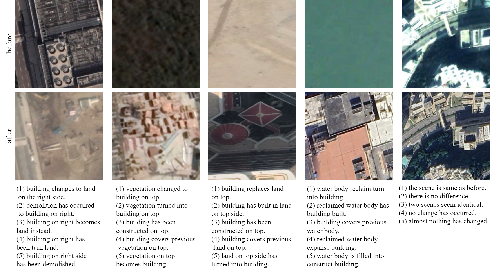
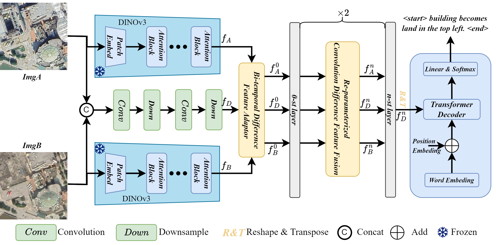

<div align="center">

<h1>DINOv3 Guided Difference Feature Fusion for Remote Sensing Image Change Captioning: A Case Study on Macao Land Cover</a></h1>
Publish in International Journal of Remote Sensing, [DOI:10.1080/01431161.2026.2655364](https://doi.org/10.1080/01431161.2026.2655364)

</div>


### Citation
```
@article{huang_rscc,
author = {Junqing Huang and Jiaxuan Lin and Hong Lin and Xiaochen Yuan},
title = {DINOv3 Guided difference feature fusion for remote sensing image change captioning: a case study on Macao land cover},
journal = {International Journal of Remote Sensing},
volume = {47},
number = {11},
pages = {4596--4618},
year = {2026},
publisher = {Taylor \& Francis},
doi = {10.1080/01431161.2026.2655364},
URL = {https://doi.org/10.1080/01431161.2026.2655364},
eprint = {https://doi.org/10.1080/01431161.2026.2655364}
}
```

## MLCC Dataset 

Samples of the MLCC dataset, including bi-temporal RSIs and corresponding change captions. Each RSIs pairs along with five sentence descriptions.

**Download [https://www.modelscope.cn/datasets/chuntsing/MLCC/files](https://www.modelscope.cn/datasets/chuntsing/MLCC/files)**

## DINO-DFFCC
Here, we provide the pytorch implementation of the paper: "DINOv3 Guided Difference Feature Fusion for Remote Sensing Image Change Captioning: A Case Study on Macao Land Cover". 


The structure of DINO-DFFCC, where $Conv$ indicates convolution, batch normalization, ReLU. In DINO-DFFCC, DINOv3 is utilized to extract RSIs features. BDFA is designed to adapt DINOv3 to align with the requirements of RSICC. RCDFF is utilized to fuse difference information from feature map generated by BDFA. The final output $f_D^n$ of RCDFF is processed through a Transformer Decoder to generate the caption.

### DINOv3
We use the weights of DINOv3 pre-trained weights.
Please refer [DINOv3](https://github.com/facebookresearch/dinov3.git) 

### Data preparation
Firstly, put the downloaded dataset in `./MLCC/`.
Then preprocess dataset as follows:
```python
python create_files.py --min_word_freq 5
```
After that, you can find some resulted files in `./data/`. 


### Train
Make sure you performed the data preparation above. Then, start training as follows:
```python
python trainer.py  --data_folder ./data/ --savepath ./models_checkpoint/ --device 0
```

### Evaluate
```python
python eval.py --data_folder ./data/ --path ./models_checkpoint/ --Split TEST
```

## Reference:
Thanks to the following repository:

[a-PyTorch-Tutorial-to-Image-Captioning](https://github.com/sgrvinod/a-PyTorch-Tutorial-to-Image-Captioning.git)

[Awesome-RS-SpatioTemporal-VLMs](https://github.com/Chen-Yang-Liu/Awesome-RS-SpatioTemporal-VLMs.git)

[RSICCFormer](https://github.com/Chen-Yang-Liu/RSICC.git)


